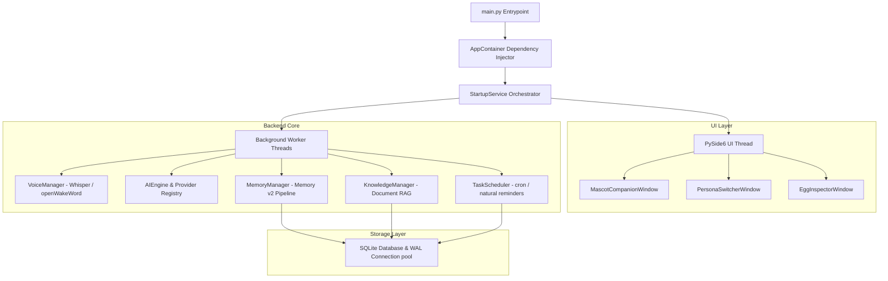
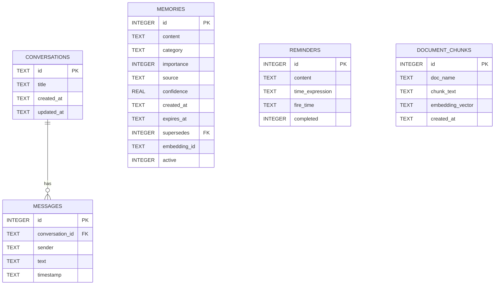
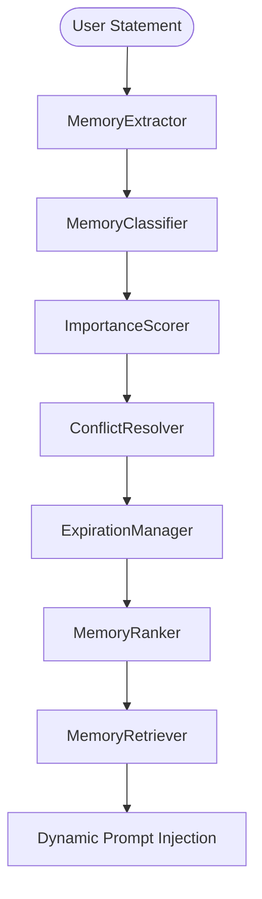
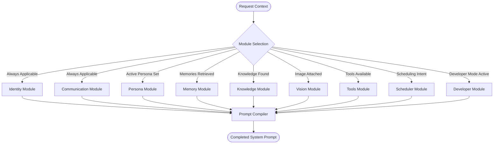
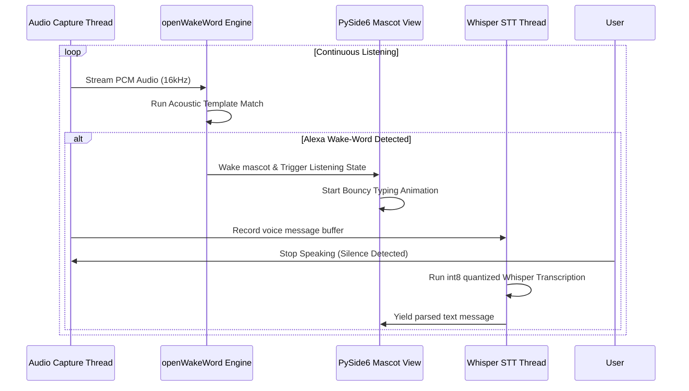
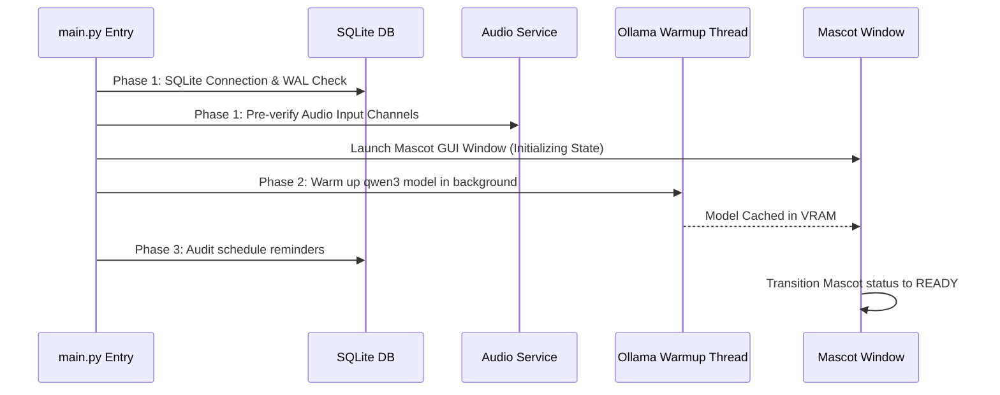

# EggMan Desktop Companion: Comprehensive Project Context & Architecture

This document serves as the complete, authoritative developer reference manual for **EggMan Desktop Companion (v0.6)**. It outlines the design philosophies, software architecture patterns, subsystem schemas, dynamic pipelines, and verification protocols that govern the codebase.

---

## 📖 Executive Summary
EggMan is a premium, high-performance, and entirely offline AI desktop companion. Unlike cloud-based assistants that leak private interactions, EggMan is designed to execute all operations—from text inference and RAG document queries to speech-to-text transcriptions and acoustic wake-word analysis—locally on the host machine. 

### Core Product Philosophies
1. **Unconditional Privacy**: No user message, file, screenshot, or synthesized audio ever leaves the local machine.
2. **Rich, Tactile Design**: Low-latency rendering, fluid micro-animations (slide-and-fade token animations), and responsive floating interfaces designed with PySide6.
3. **Continuous Background Listening**: A dual-engine audio capture setup allows hands-free voice control using local wake-word analysis.
4. **Intelligent State Persistence**: Uses a multi-tiered SQLite architecture to track system settings, conversation histories, task schedules, document indices, and long-term memory profiles.

---

## 🛠️ Global Subsystem Architecture

The codebase is organized into modular packages separating the presentation layer (PySide6 widgets) from backend orchestration services.



### Module Directory Breakdown

*   **/app**: Handles application startup configuration, system tray interactions, and dependency injection context mapping via [container.py](file:///c:/Users/anush/OneDrive/Desktop/Eggman/app/container.py).
*   **/assets**: Stores branding visual assets, fonts, layouts, and companion mascot animation frames (`idle.png`, `thinking.png`, `listening.png`, etc.).
*   **/backend**: The engine room of EggMan. Contains all factual, cognitive, sensory, and scheduling services:
    *   `/ai`: Handles local LLM routing (`LocalProvider`, `OllamaProvider`), prompt packaging, and non-blocking token streaming.
    *   `/context`: RAG context generation utilities that format and inject knowledge and long-term memories.
    *   `/database`: Direct interaction with SQLite schemas, WAL configurations, and SQL connection pools.
    *   `/embeddings`: Embeddings generation providers (auto-pulling Ollama `nomic-embed-text`) and local vector search database tables.
    *   `/emotion`: Sentiment mapping engine that dynamically updates mascot emotional reactions based on LLM response tokens.
    *   `/knowledge`: Multi-format document loading pipelines, recursive text segment splitters, and indexing queues.
    *   `/memory`: Long-term memory v2 package (extraction, scoring, categorizing, conflict resolution, expiration, retrieval).
    *   `/personas`: Built-in and custom system-prompt persona blueprints.
    *   `/profiler`: Diagnostic telemetry trackers calculating timing breakdowns, tokens/sec speeds, and first-token latencies.
    *   `/prompt`: Registry-driven Prompt Builder v2 compiler utilizing caching and dynamic block inclusion.
    *   `/scheduler`: Natural language reminder parser and persistent timer execution loops.
    *   `/session`: Global application state manager running on thread-safe `SessionContext` structures.
    *   `/startup`: Sequential/parallel app initialization scripts.
    *   `/tools`: Operating system interaction widgets (Clipboard, Calculator, AppLauncher).
    *   `/vision`: Capture hooks for active monitors feeding images directly to local LLM vision models.
    *   `/voice`: Local Whisper voice transcription and openWakeWord wake-word listeners.
*   **/core**: Configurations, slash command routing, path resolve tools, and core CSS themes.
*   **/ui**: Custom PySide6 views (Egg Inspector dialogs, switchers, companion bubbles, sliding frames).
*   **/tests**: Comprehensive pytest suite (60+ unit tests) validating individual subsystem compliance.

---

## 💾 SQLite Database & WAL Schema Architecture

EggMan stores long-term facts, vector representations, conversation logs, and scheduling records in a structured SQLite database. To support concurrency—enabling background document indexing or memory sweep routines without locking UI database operations—the system initializes connection pools using **Write-Ahead Logging (WAL)** mode.

### Database Tables and Columns



1. **`conversations`**: Stores active chat sessions.
2. **`messages`**: Chronological log of individual user statements and companion replies.
3. **`memories`**: Manages v2 memory records. Integrates:
   *   `category` (Preferences, Goals, Habits, Skills, Projects, Personal Facts, Temporary, Permanent)
   *   `importance` (0 to 100 rating scale)
   *   `source` (system / direct_statement / inference)
   *   `expires_at` (for temporary facts)
   *   `supersedes` (foreign key connecting to deprecated memories resolved by conflict logic)
   *   `embedding_id` (reference index pointing to vector representations)
   *   `active` (1 = active, 0 = inactive)
4. **`reminders`**: Task descriptions, scheduling expressions, target timestamps, and audit completion flags.
5. **`document_chunks`**: Document reference blocks, raw text, timestamp metadata, and corresponding vector serialization arrays.

---

## 🧠 Memory System v2 Subsystem Deep-Dive

Memory System v2 manages EggMan's personal knowledge of the user. Instead of injecting the entire history of interactions into every prompt, v2 parses, scores, resolves, and retrieves user facts using a highly structured, modular pipeline.



### 1. `MemoryExtractor`
*   **Role**: Parses user turns and extracts factual statements.
*   **Logic**: Scans sentences for patterns matching user descriptions (e.g. "I love...", "My job is...", "Remember that..."). If a sentence qualifies, it extracts the target fact.

### 2. `MemoryClassifier`
*   **Role**: Assigns extracted facts to one of 8 distinct categories.
*   **Categories**:
    *   `Preferences`: User choices regarding software, themes, languages, settings.
    *   `Goals`: User projects, task list objectives, short-term ambitions.
    *   `Habits`: Recurrent activities or preferences (e.g., "I code late at night").
    *   `Skills`: Languages, frame ecosystems, or domain expertise levels.
    *   `Projects`: Active workspace names, repository targets, files being built.
    *   `Personal Facts`: Family names, location, job descriptions, birthday.
    *   `Temporary`: Expirable short-term context statements.
    *   `Permanent`: Fundamental statements that rarely shift.

### 3. `ImportanceScorer`
*   **Role**: Assigns a numeric rating from `0` to `100` to dictate prompt injection weights.
*   **Mechanism**: Employs categorical multipliers and keyword search maps (e.g. phrases like "never", "always", "important" boost values significantly, whereas casual descriptions rank lower).
*   **Migration Compatibility**: Converts legacy system string values (`low` / `medium` / `high`) to integers (`20` / `50` / `80`) automatically.

### 4. `ConflictResolver`
*   **Role**: Detects and overrides old conflicting facts.
*   **Topic Groups**: Maps facts into semantic semantic groups (e.g., "Language", "Editor", "OS", "Theme").
*   **Deactivation**: If a user says "I use VS Code" and later says "I switched to Cursor", the resolver flags the mismatch, sets the old memory record's `active` column to `0`, and populates the new record's `supersedes` column with the ID of the deprecated entry.

### 5. `ExpirationManager`
*   **Role**: Manages expirable facts.
*   **Expiration Duration**: Default duration is set to **48 hours** for facts categorized as `Temporary`.
*   **Lazy Sweeping**: Checks and marks expired facts as inactive during the retrieve pipeline run, preventing unnecessary background thread resource locks.

### 6. `MemoryRanker` & `MemoryRetriever`
*   **Role**: Evaluates applicable memories for active queries.
*   **Formula**: Scores candidate memories using a multi-factor weighting index:
    $$\text{Score} = (\text{Relevance} \times 0.40) + (\text{Importance} \times 0.30) + (\text{Recency} \times 0.15) + (\text{Confidence} \times 0.10) + (\text{CategoryBoost} \times 0.05)$$
*   **Triviality Filter**: Bypasses memory queries for greetings or short statements (e.g. "hello", "thanks", "ok"), saving database search time.

---

## 🧩 Prompt Builder v2 Subsystem Deep-Dive

To eliminate token clutter and improve prompt assembly execution times, EggMan v0.6 uses a **dynamic, modular registry-driven prompt builder**.



### Registry-Based Dynamic Blocks
Every segment of system instructions is isolated as an implementation subclass of `PromptModule` registering itself to a global `PromptRegistry`:

1.  **Identity Module**: Dictates companion characteristics, honesty about digital nature, and companion boundaries.
2.  **Persona Module**: Injects active persona specifications (Normal, Coding, Party) directly into the assembly layout.
3.  **Communication Module**: Defines casual phrasing preferences, contractions mapping, banned customer-support wording, conversational flow rules, and Voice Mode short-phrasing overrides.
4.  **Memory Module**: Guidelines warning the LLM not to over-inject retrieved facts unless directly relevant.
5.  **Knowledge Module**: RAG guidelines instructing the LLM on how to present retrieved documentation chunks naturally.
6.  **Vision Module**: Active instructions detailing screenshot analysis boundaries.
7.  **Tools Module**: Execution boundaries instructing the LLM to verify file and calculator actions concisely.
8.  **Scheduler Module**: Output constraints governing task verification confirmations.
9.  **Developer Module**: Appends debug information if diagnostics are toggled.

### Compile Caching
To keep compilation times below 1ms, static modules (like `Identity` and `Communication`) are cached within `PromptCache`. They are retrieved from the cache unless the conversation settings (like voice toggle or active persona) are updated, in which case the cache is cleared.

---

## 📊 Telemetry and Diagnostics Tab Layouts

Egg Inspector v2 (accessible via `/dev`) compiles detailed telemetry from across the application.

```
=============================================================================
                    🥚 EGG INSPECTOR DIAGNOSTICS (v0.6)
=============================================================================
 [ 📈 Perf ]  [ 🚀 Boot ]  [ 📚 RAG ]  [ 🧠 Prompt ]  [ 💾 Memory ]  [ 🎤 Audio ]
-----------------------------------------------------------------------------
  PROMPT ANALYSIS & OPTIMIZATION:
  * Total Prompt Tokens:           142 tokens
  * Prompt Characters:             568 characters
  * Prompt Build Duration:         0.45 ms
  * Prompt Reduction Percentage:   64.2%  [OPTIMIZED]
  * Cache Hits / Misses:           18 / 2

  PROMPT MODULES BREAKDOWN:
  ----------------------------------------------------------------------
   Module Name      Status       Tokens      Characters      Gen Time
  ----------------------------------------------------------------------
   ✓ Identity       Used         68          272             0.02 ms
   ✓ Persona        Used         32          128             0.12 ms
   ✓ Communication  Used         42          168             0.05 ms
   ✗ Memory         Omitted      0           0               0.00 ms
   ✗ Knowledge      Omitted      0           0               0.00 ms
   ✗ Vision         Omitted      0           0               0.00 ms
   ✗ Tools          Omitted      0           0               0.00 ms
   ✗ Scheduler      Omitted      0           0               0.00 ms
   ✗ Developer      Omitted      0           0               0.00 ms
=============================================================================
```

### Telemetry Dashboards

1.  **🧠 Prompt Tab (New)**: Details character/token counts per module, active status, cache efficiency, and prompt reduction percentages compared to monolithic designs.
2.  **💾 Memory Tab (New)**: Details database metrics, confidence distributions, active vs deactivated counts, and expirable sweeping ratios.
3.  **📈 Performance Tab**: Measures first-token response times, average streaming speed (tokens/sec), and lists pipeline stage durations in horizontal telemetry timelines.
4.  **🚀 Startup Tab**: Displays the initialization speed of concurrent startup threads to pinpoint bottlenecks.
5.  **📚 Knowledge Tab**: Tracks search time for RAG queries, document chunks loaded in SQLite, model compatibility, and embedding status.

---

## 🎙️ Dual-Engine Audio & Wake-Word Architecture

EggMan implements a continuous audio capture loop. To run efficiently on standard consumer CPU threads, the voice subsystem is split into two specialized engines:



### Subsystem Settings
*   **Wake-Word Module**: Utilizes `openWakeWord` configured with an Alexa model. This is lightweight enough to run continuously on a single CPU core without consuming GPU memory.
*   **Speech-to-Text Module**: Utilizes `faster-whisper` running locally with `int8` quantization. This optimizes memory usage and speed when transcribing spoken user queries.

---

## ⚡ Eager Parallel Startup Execution

To minimize startup delays, EggMan separates boot initialization into three distinct, structured phases. The GUI mascot is displayed immediately, while heavy model handshakes and reminder audits execute asynchronously.



1.  **Phase 1: Basic Systems Initialization**: Loads user configuration settings, checks SQLite database connectivity, sets WAL mode parameters, and verifies system audio input drivers.
2.  **Phase 2: Mascot UI Launch & Model Warmup**: The PySide6 window renders immediately with a loading animation. A background thread warms up the model inside Ollama's active memory slot (VRAM), preventing first-turn latency.
3.  **Phase 3: Reminder Audits**: Queries SQLite for tasks scheduled while the application was offline, showing notifications for overdue items before setting the mascot status to `READY`.

---

## ⚡ Event Bus Subsystem (v0.7)
A decoupled, thread-safe communication backbone constructed to allow modules to interact without compile-time dependencies.
*   **Decoupled Registration**: Modules subscribe to event classes (`BaseEvent` subclasses) dynamically.
*   **Concurrent Thread Protection**: Uses reentrant locking (`threading.RLock`) to guard subscribers. Executions run outside the lock to prevent thread deadlocks.
*   **Exception Isolation**: Prevents subscriber callbacks raising exceptions from breaking the loop context of other subscribers.
*   **Startup Proof-of-Concept**: Employs `StartupTaskStartedEvent`, `StartupTaskCompletedEvent`, and `StartupCompletedEvent` to report concurrent stage completions.

---

## 🗃️ Registry Subsystem (v0.7)
A production-quality Registry Framework designed to decouple EggMan's core capabilities and tool execution contexts.
*   **BaseRegistry Infrastructure**: Thread-safe base implementation (`BaseRegistry`) supporting registration, unregistration, validation, duplicate prevention, thread-safe iteration, and ID lookup.
*   **Capabilities vs. Tools**:
    *   **Capabilities**: Descriptive metadata profiles representing *what* EggMan can do (e.g. `Voice`, `Vision`, `Desktop Automation`, `Knowledge`, `Developer`).
    *   **Tools**: Executable modules describing *how* EggMan performs actions (e.g., `Calculator`, `Clipboard`, `Screenshot`, `Launch Application`, `Knowledge Search`), mapping to parents.
*   **Automatic Registration**: Annotations (`@capability(...)` and `@tool(...)`) register configurations dynamically during initialization, eliminating manual bootstrapping.
*   **Decoupled Event Bus Hooks**: Dispatches strongly-typed events (`CapabilityRegisteredEvent`, `ToolRegisteredEvent`, `CapabilityEnabledEvent`, etc.) directly through the dependency-injected Event Bus.
*   **Dynamic Help Command**: Replaced hardcoded help menus in `HelpWindow` to dynamically construct capability grids from the active `CapabilityRegistry`.

---

## 📦 PyInstaller Compiling Pipeline

EggMan compiles into a standalone, zero-dependency executable directory using PyInstaller.

### PyInstaller Spec Configuration (`EggMan.spec`)
The compilation is configured to package all necessary runtime assets:
*   **Avatar assets**: Mascot frame directories (`assets/`).
*   **Audio files**: Sounds, notifications, and default templates.
*   **Wake-Word Models**: Bundles `.tflite` model files and dependencies required by `openWakeWord`.
*   **Whisper libraries**: Bundles Whisper C-libraries and model architectures.

To trigger the executable compilation script:
```bash
pyinstaller -y EggMan.spec
```
The output executable is bundled at **`dist/EggMan/EggMan.exe`**.
