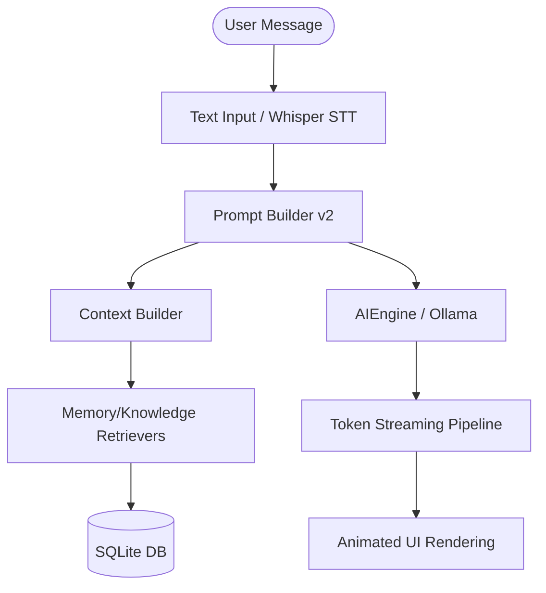

# EggMan Project Context

This document serves as the comprehensive architectural reference, implementation history, and developer context for the EggMan Desktop Companion application.

---

## 🍳 Overview
EggMan is a premium, fully offline AI desktop companion built with PySide6 and Python 3.11. It utilizes Ollama for local LLM text generation and vision tasks, faster-whisper for speech-to-text transcription, openWakeWord for continuous background wake-word activation, and SQLite for persistent local database storage (RAG and Memory).

---

## 🛠️ Architecture & Data Flows

### 1. The Interaction Pipeline
1.  **Input Channel**: User input is received either via text in the input box or parsed from microphone input using the `faster-whisper` STT model.
2.  **Context Construction**: The request is routed to `AIEngine`, which calls `PromptBuilder` and `ContextBuilder`.
3.  **Prompt Builder v2**: Resolves applicable prompt blocks (`identity`, `persona`, `communication`, `memory`, `knowledge`, `vision`, `tools`, `scheduler`, `developer`) dynamically based on context flags (e.g. presence of images, scheduling intents, developer mode active status) and compiles the system prompt. Static parts are cached.
4.  **Retrieval Integration**: Evaluates user queries and retrieves semantic context (RAG document chunks) and long-term memory records from SQLite.
5.  **Inference**: Packages the system prompt, history, attachments, and retrieves inferences from local Ollama instances (e.g. `qwen3:8b` or `qwen2.5vl:7b`).
6.  **Streaming & UI**: Tokens are immediately yielded to the UI thread where they animate onto the screen using vertical slide-in fade animations.

---

## 🚀 Key Improvements & Version History

### Phase 1: Embedding Auto-Pull & Stability Fixes
*   **Auto-Pulling Embedding Models**: Added auto-pull logic for missing embedding models (default: `nomic-embed-text`) during startup and embedding lifecycle events.
*   **Thread Safety in SQLite**: Enabled WAL (Write-Ahead Logging) mode on the SQLite database configuration to ensure thread safety during background indexing.
*   **Dimension Mismatch Fallback**: Handled dimension mismatch errors gracefully during indexing and vector searches.

### Phase 2: Memory System v2
Replaced the monolithic rule-based memory system with a robust long-term memory architecture:
*   **Decoupled Memory Modules**: Created dedicated components for classifying, scoring, resolving conflicts, expiring, and ranking memories:
    *   `MemoryClassifier`: Maps facts to 8 specific categories (Preferences, Goals, Habits, Skills, Projects, Personal Facts, Temporary, Permanent).
    *   `ImportanceScorer`: Assigns 0-100 values to memory importance based on categories, explicitness, and user keywords.
    *   `ConflictResolver`: Automatically detects conflicting statements within semantic topic groups and deactivates old records.
    *   `ExpirationManager`: Lazily sweeps and deactivates temporary memories after a 48-hour duration.
    *   `MemoryRanker` & `MemoryRetriever`: Applies multi-factor retrieval weights and filters out completely irrelevant records from prompt injections.
*   **Database Schema Migration**: Upgraded SQLite schemas with `source`, `expires_at`, `supersedes`, `embedding_id`, and `active` columns. Migrated string-based importances to integers (20/50/80).

### Phase 3: Prompt Builder v2
Replaced the monolithic static system prompt with a dynamic prompt compiler:
*   **Prompt Registry & Modules**: Built a registry system where prompt blocks register themselves dynamically. Added 9 core modules representing specialized domain knowledge.
*   **Prompt Caching**: Implemented a caching system for static blocks (e.g., Identity, Communication) to avoid compile-time overhead.
*   **Egg Inspector UI Integration**: Added a dedicated Prompt tab to show character counts, token distributions, per-module compilation durations, cache performance, and reduction percentages.

---

## 📊 Diagnostic Telemetry Tabs (Egg Inspector)

### 📈 Performance Tab
Displays live request latency metrics, token speeds, and stage timeline breakdowns.

### 🚀 Startup Tab
Displays concurrent startup service execution profiles to diagnose boot time delays.

### 📚 Knowledge Tab
Tracks total and pending PDF/document counts, database sizes, retrieval statistics, and embedding model status.

### 🧠 Prompt Tab
Shows active prompt modules, per-module character/token counts, cache status, and reduction diagnostics.

### 💾 Memory Tab
Shows memory totals, active/expired/superseded breakdown, and category/importance distributions.
