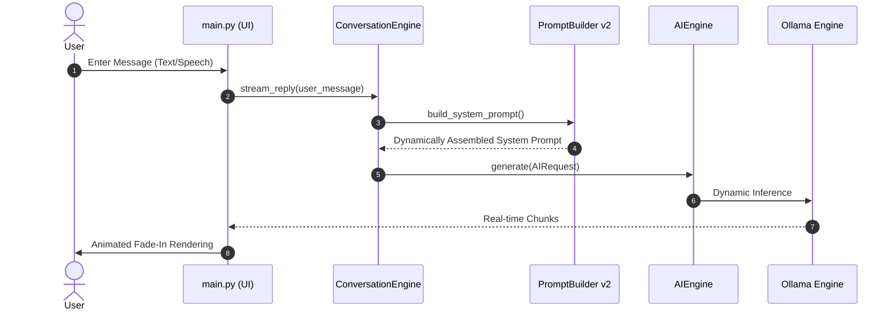

# 🥚 EggMan v0.7

[](https://www.python.org/)
[](https://wiki.qt.io/Qt_for_Python)
[](https://ollama.com/)
[](https://docs.pytest.org/)

> **The Ultimate Local, Emotional AI Desktop Companion**  
> EggMan is a premium, fully offline AI assistant that lives directly on your desktop. Combining real-time streaming, local vector storage, an advanced persistent memory system, wake-word activation, screen vision, and dynamic persona overlays, EggMan delivers a desktop assistant experience that is private, highly reactive, and responsive.

---

## 📖 Table of Contents
1. [🚀 Core Modules in Version 0.7](#-core-modules-in-version-0.7)
2. [🧠 Memory System v2](#-memory-system-v2)
3. [🧩 Prompt Builder v2](#-prompt-builder-v2)
4. [⚡ Event Bus Infrastructure](#-event-bus-infrastructure)
5. [🗃️ Capability & Tool Registry V2](#-capability--tool-registry-v2)
6. [📁 Repository Structure](#-repository-structure)
7. [💻 Developer Quick Start](#-developer-quick-start)
8. [📦 PyInstaller Bundling](#-pyinstaller-bundling)

---

## 🚀 Core Modules in Version 0.7

### ⚡ Fluid Token Streaming & Micro-Animations (Present)
### 🎭 Floating Persona Selector (Present)
### 📦 Ollama Model Auto-Pulling (Present)

---

## 🧠 Memory System v2 (Present)

---

## 🧩 Prompt Builder v2 (Present)

---

## ⚡ Event Bus Infrastructure

EggMan v0.7 introduces a custom, production-ready **Event Bus System** that serves as the decoupled communication backbone of the companion:
- **Strongly-Typed Event Objects:** Communication uses BaseEvent subclasses (e.g. `StartupTaskStartedEvent`, `StartupTaskCompletedEvent`) instead of raw strings.
- **Concurrently Thread-Safe:** Employs reentrant locking (`threading.RLock`) to safely register callbacks and dispatch events across parallel background threads.
- **Exception Isolation:** Guarantees that callback failures in one subscriber do not block the publication flow to other modules.
- **Proof-of-Concept Integration:** Migrated the **Startup System** to decoupled Event Bus notifications to coordinate thread-safe UI state updates.

---

## 🗃️ Capability & Tool Registry (v0.7)

EggMan v0.7 implements a highly extensible **Registry Subsystem** designed to eliminate hardcoded feature lists and modularize the runtime environment:
- **BaseRegistry Backbone:** Standardizes operations (`register`, `unregister`, `get`, `exists`, `clear`, iteration, ID lookup) with reentrant locking (`threading.RLock`) for full thread safety.
- **Capabilities (Descriptive):** Profiles representing what EggMan is capable of (`Voice`, `Vision`, `Desktop Automation`, `Knowledge`, `Developer`).
- **Tools (Executable V2):** Connects to parents and wraps executable objects (`Calculator`, `Clipboard`, `Screenshot`, `Launch Application`, `Knowledge Search`) with strict metadata schemas.
- **Dynamic Help Dialog:** Rewrites the `/help` window layout to dynamically read and build UI cards representing active capabilities and their health status on the fly.
- **Event Bus Integration:** Dispatches state change events (`CapabilityRegisteredEvent`, `ToolRegisteredEvent`, `CapabilityEnabledEvent`, etc.) directly via the Event Bus for out-of-band updates.

---

## 📊 Egg Inspector Diagnostics (Present)

---

## 🎭 Persona System (v1) (Present)

---

## ⚡ Startup System v2 (Present)

---

## 🛠️ Architectural Workflow



---

## 🎙️ Wake-Word & Voice Interface

- **Wake-Word Engine:** Uses `openWakeWord` configured with an `"Alexa"` acoustic footprint.
- **Speech-to-Text (STT):** Powered by `faster-whisper` using CPU `int8` quantization for responsive local voice transcription.
- **Speech Bubble Indicator:** Shows an Instagram-style bouncing three-dots typing animation over the companion during processing.

---

## 📁 Repository Structure

```text
Eggman/
├── app/                  # Application containers and initializers
├── assets/               # Images, icons, and theme files
├── backend/              # Core background engines
│   ├── ai/               # Provider routing, models, and StreamingResponse
│   ├── context/          # RAG Context & Knowledge Builders
│   ├── database/         # SQLite schema & SQL execution layers
│   ├── embeddings/       # Vector storage & chromadb integrations
│   ├── emotion/          # Emotion mapping engines
│   ├── knowledge/        # PDF loaders & document management
│   ├── memory/           # Classifiers, scorers, conflict resolvers (v2)
│   ├── personas/         # Persona subclasses & PersonaManager (v1)
│   ├── profiler/         # Diagnostics & Telemetry (v2)
│   ├── prompt/           # Modular PromptBuilder, registries, caches (v2)
│   ├── startup/          # StartupService & profile logger (v2)
│   ├── tools/            # Native OS execution tools (Calc, Clipboard)
│   ├── vision/           # Screen captures and VisionManager
│   └── voice/            # Speech-to-text & openWakeWord services
├── core/                 # Configurations, slash command routing, and themes
├── ui/                   # PySide6 widgets, custom Dialogs, and Switchers
├── tests/                # Pytest suites (60+ unit tests)
├── main.py               # Application entry point
├── EggMan.spec           # PyInstaller spec file
└── requirements.txt      # Main project dependencies
```

---

## 💻 Developer Quick Start

### 1. Set Up Environment
```bash
python -m venv .venv
.venv\Scripts\activate
pip install -r requirements.txt
```

### 2. Pull Ollama Models
Ensure Ollama is running locally, then fetch the required models:
```bash
ollama pull qwen3:8b
ollama pull qwen2.5vl:7b
ollama pull nomic-embed-text
```

### 3. Launch Application
```bash
python main.py
```

### 4. Run Tests
```bash
pytest
```

---

## 📦 PyInstaller Bundling

To compile a standalone, zero-dependency executable distribution of EggMan, run:

```bash
pyinstaller -y EggMan.spec
```

The completed build is written to **`dist/EggMan/EggMan.exe`**. The build system bundles Whisper models, wake-word parameters, and avatar assets automatically.
