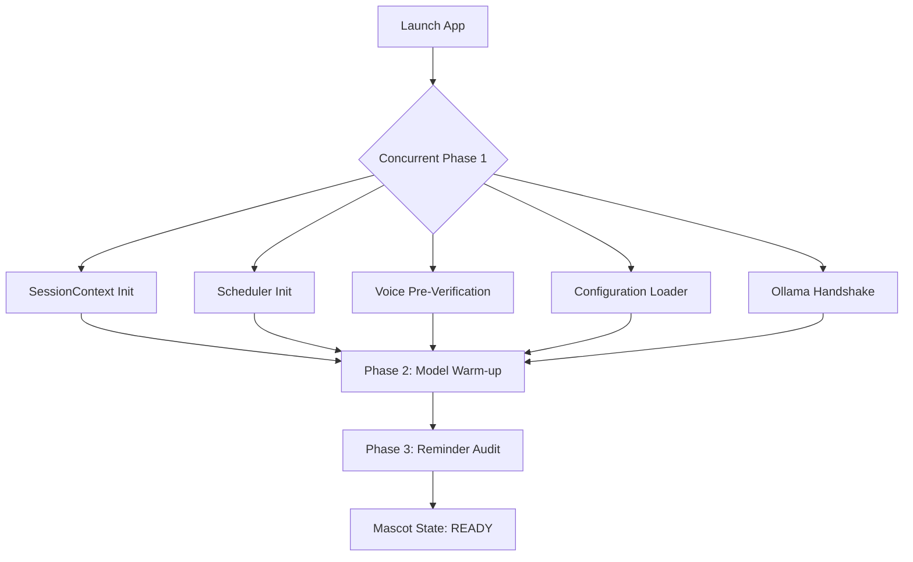
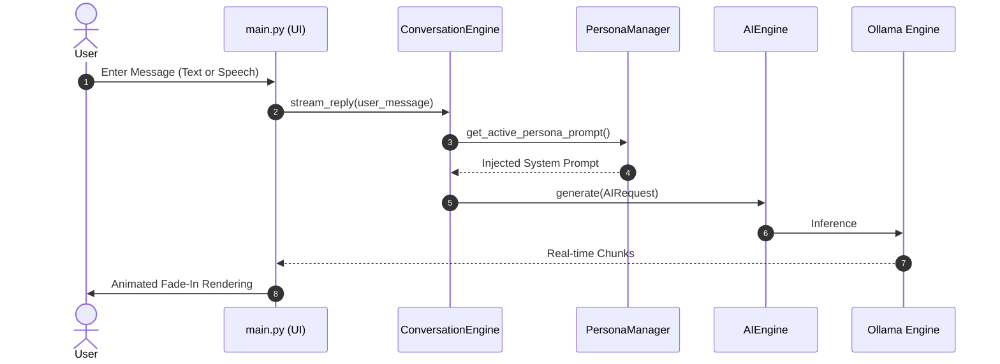

# 🥚 EggMan v0.5

[](https://www.python.org/)
[](https://wiki.qt.io/Qt_for_Python)
[](https://ollama.com/)
[](https://docs.pytest.org/)

> **The Ultimate Local, Emotional AI Desktop Companion**  
> EggMan is a premium, fully offline AI assistant that lives directly on your desktop. Combining real-time streaming, local vector storage, persistent facts database, wake-word activation, screen vision, and dynamic persona overlays, EggMan delivers a desktop assistant experience that is private, highly reactive, and responsive.

---

## 📖 Table of Contents
1. [🚀 New Features in Version 0.5](#-new-features-in-version-05)
2. [🎭 Persona System (v1)](#-persona-system-v1)
3. [📊 Egg Inspector v2 (Diagnostics)](#-egg-inspector-v2-diagnostics)
4. [⚡ Startup System v2 (Parallel boot)](#-startup-system-v2-parallel-boot)
5. [🛠️ Core Architectural Workflow](#-core-architectural-workflow)
6. [🎙️ Wake-Word & Voice Interface](#-wake-word--voice-interface)
7. [📁 Repository Structure](#-repository-structure)
8. [🧰 Technology Stack](#-technology-stack)
9. [💻 Developer Quick Start](#-developer-quick-start)
10. [📦 PyInstaller Bundling & Packaging](#-pyinstaller-bundling--packaging)

---

## 🚀 New Features in Version 0.5

### ⚡ Fluid Token Streaming & Micro-Animations
- **Zero-Latency Rendering:** Tokens are written directly to the screen as soon as they are received from the local Ollama stream, bypassing all buffer lag.
- **Micro-Animations:** Custom-rendered words feature a smooth, lightweight fade-in combined with a vertical slide glide (150ms) to enhance readability.
- **Smart Sizing Policies:** Message bubbles scale up to **72% of the active window width** for paragraphs and technical code, while shrinking to fit short one-liners.

### 🎭 Floating Persona Selector
- **Title Bar Integration:** Triggered via a `🎭` icon on the right side of the Title Bar.
- **Smooth Popup Transition:** Cards cascade with a staggered 60ms slide-in spring animation from right-to-left.
- **Click-to-Dismiss:** Closes automatically on select or when clicking outside.

---

## 🎭 Persona System (v1)

EggMan now features a **Modular Persona System**. Switching your companion's identity dynamically alters its system prompt module (tone, humor, vocabulary, formatting constraints) and synchronizes its mascot avatar, keeping backend capabilities identical.

| Persona | Key | Emoji | Avatar | Vibe / Style |
| :--- | :--- | :---: | :---: | :--- |
| **Normal** | `normal` | 🥚 | Classic Mascot | Calm, practical, Curiously honest. Uses classic `thinking.png` state. |
| **Coding Guy** | `coding` | 💻 | Senior Dev Avatar | Passionate engineer. Makes occasional dry programming jokes/analogies. |
| **Party Boi** | `party` | 🍺 | Party Hat Avatar | Playful, chaotic, carefree. Stretches vowels (`helloooo`) and uses slang. |

> [!NOTE]
> Persona configurations are stored and persisted inside `eggman_settings.json` under `"active_persona"`.

---

## 📊 Egg Inspector v2 (Diagnostics)

Egg Inspector v2 is a premium, expandable developer analytics engine accessible via the `/dev` slash command.

- **Real-Time Telemetry:** Tracks first-token latency, tokens/sec generation speed, total characters, keep-alive status, and active provider.
- **Stacked Prompt Bar:** Displays system, user, and conversation history prompt tokens visually in a relative percentage stacked bar.
- **Timeline Visualization:** Shows horizontal bars representing time spent in each stage (e.g. Memory retrieval, Prompt building, Ollama response).
- **Interactive Request Comparison:** Compares current request statistics to your historical database averages with positive/negative color-coded delta indicators.

---

## ⚡ Startup System v2 (Parallel Boot)

To bypass model loading latency, the startup process initializes independent services concurrently:



- **Background LLM Preheating:** Spawns a background thread immediately on boot to warm the active model in VRAM, eliminating first-message lag.
- **Boot Profiling:** Logs timing metrics for each loading stage, accessible directly via the **Startup Diagnostics** tab in the Egg Inspector.

---

## 🛠️ Core Architectural Workflow

EggMan routes request handling through a clean Pipeline structure:



---

## 🎙️ Wake-Word & Voice Interface

EggMan listens continuously in the background using dual-engine audio drivers:

- **Wake-Word Engine:** Uses `openWakeWord` configured with an `"Alexa"` acoustic footprint. When detected, EggMan wakes up without noisy beeps.
- **Speech-to-Text (STT):** Powered by `faster-whisper` using CPU `int8` quantization for responsive local voice transcription.
- **Speech Bubble Indicator:** Shows an Instagram-style bouncing three-dots typing animation over the companion during processing.

---

## 📁 Repository Structure

```text
Eggman/
├── app/                  # Application containers and initializers
├── assets/               # Images, icons, and theme files
├── backend/              # Core background engines
│   ├── ai/               # Provider routing, models, and StreamingResponse
│   ├── context/          # RAG Context & Knowledge Builders
│   ├── database/         # SQLite schema & SQL execution layers
│   ├── embeddings/       # Vector storage & chromadb integrations
│   ├── emotion/          # Emotion mapping engines
│   ├── knowledge/        # PDF loaders & document management
│   ├── memory/           # Persistent fact extractors
│   ├── personas/         # Persona subclasses & PersonaManager (v1)
│   ├── profiler/         # Diagnostics & Telemetry (v2)
│   ├── startup/          # StartupService & profile logger (v2)
│   ├── tools/            # Native OS execution tools (Calc, Clipboard)
│   ├── vision/           # Screen captures and VisionManager
│   └── voice/            # Speech-to-text & openWakeWord services
├── core/                 # Configurations, slash command routing, and themes
├── ui/                   # PySide6 widgets, custom Dialogs, and Switchers
├── tests/                # Comprehensive pytest suites (50+ unit tests)
├── main.py               # Application entry point
├── EggMan.spec           # PyInstaller spec file
└── requirements.txt      # Main project dependencies
```

---

## 🧰 Technology Stack

- **Language:** Python 3.11
- **UI Framework:** PySide6 (Qt for Python)
- **Local Inference Engine:** Ollama (`qwen3:8b` for text, `qwen2.5vl:7b` for screen screenshots)
- **Transcription Pipeline:** `faster-whisper`
- **Wake Word Detection:** `openWakeWord`
- **Fact Storage:** SQLite
- **Test Framework:** Pytest
- **Compiler:** PyInstaller

---

## 💻 Developer Quick Start

### 1. Set Up Environment
Ensure you have Python 3.11 installed, then run:
```bash
python -m venv .venv
.venv\Scripts\activate
pip install -r requirements.txt
```

### 2. Pull Ollama Models
Ensure Ollama is running locally, then fetch the required models:
```bash
ollama pull qwen3:8b
ollama pull qwen2.5vl:7b
```

### 3. Launch Application
```bash
python main.py
```

### 4. Run Tests
Validate the application status using our testing suite:
```bash
pytest
```

---

## 📦 PyInstaller Bundling & Packaging

To compile a standalone, zero-dependency executable distribution of EggMan, run:

```bash
pyinstaller -y EggMan.spec
```

The completed build is written to **`dist/EggMan/EggMan.exe`**. The build system bundles Whisper models, wake-word parameters, and avatar assets automatically.
