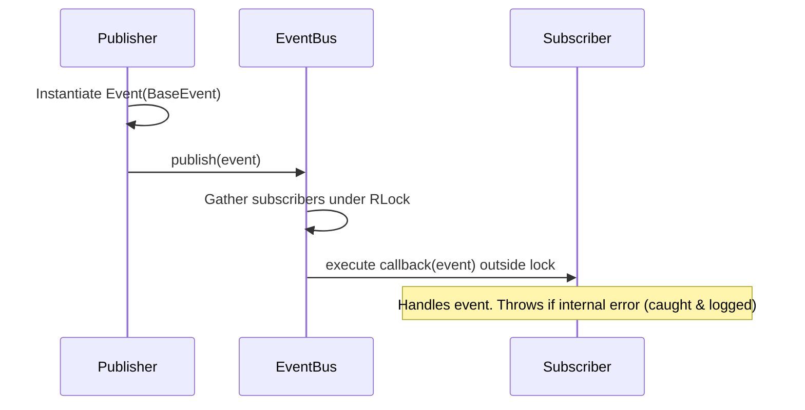

# EggMan Event Bus Subsystem Documentation

This package implements a decoupled, thread-safe Event Bus that serves as the communication backbone for the EggMan application.

---

## 🏛️ Architecture Decisions

1.  **No Global Singleton**: To ensure testability and prevent tight coupling, the `EventBus` is instantiated as a service inside the `AppContainer` and injected via constructor dependency injection.
2.  **Thread Safety**: Subscribers are registered within a thread-safe dictionary protected by a reentrant lock (`threading.RLock()`). Callbacks are gathered under the lock but executed *outside* the lock to prevent deadlock conditions.
3.  **Exception Isolation**: Listener callback failures are caught and logged inside the `publish` routine, preventing one broken callback from halting event propagation to other subscribers.
4.  **Base Event Class**: Events are strongly-typed Python objects inheriting from `BaseEvent`. Dataclasses with `frozen=True` are preferred to guarantee immutability.

---

## 🔄 Event Lifecycle



---

## 🆕 How to Add New Events

1.  Create a custom event class inheriting from `BaseEvent` inside `backend/event_bus/event_types.py` or a domain-specific events file:
    ```python
    from dataclasses import dataclass
    from backend.event_bus.event import BaseEvent

    @dataclass(frozen=True)
    def MyNewEvent(BaseEvent):
        my_data: str = ""
    ```

---

## 📥 How Modules Subscribe

Inject the `EventBus` instance into your module and subscribe callbacks using the event class:
```python
class MyService:
    def __init__(self, event_bus):
        self._event_bus = event_bus
        self._event_bus.subscribe(MyNewEvent, self.on_my_event)

    def on_my_event(self, event: MyNewEvent):
        print(f"Received custom data: {event.my_data}")
```

---

## ⚡ Future Async Extension Points

To scale towards asynchronous publishing (e.g. asyncio or background thread pools) without breaking the existing public API:
*   A future method `publish_async(event)` can be introduced to leverage a loop executor or thread pool queue:
    ```python
    def publish_async(self, event: BaseEvent) -> None:
        """Asynchronously dispatches an event via a thread pool or run loop executor."""
        # implementation will fetch subscribers and schedule them on an event loop or worker queue
        pass
    ```
*   `publish` remains synchronous for short latency GUI actions or critical pipelines, while heavy integration workers can utilize the async pathway.
